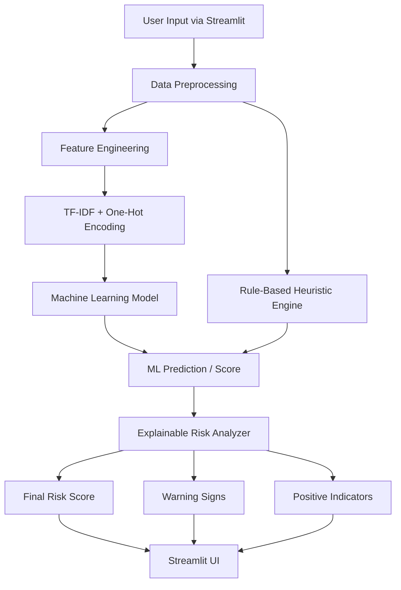

# JobShield AI – Explainable Job Scam Detection System

JobShield AI is an AI/ML web application that analyzes job postings and estimates whether they are potentially legitimate or suspicious. The system combines machine learning with rule-based analysis to provide a risk score, risk level, detected warning signs, and an explanation of why a job posting was flagged.

## Architecture



## Problem Statement

Job seekers can be exposed to fraudulent employment opportunities that may attempt to obtain money, personal information, or sensitive credentials. Fraudulent postings can sometimes resemble legitimate job advertisements, making manual identification difficult.

JobShield AI aims to assist users by analyzing job-posting content and identifying patterns associated with potentially suspicious postings.

## Objective

To develop an explainable machine learning system that analyzes job postings, estimates their risk level, and provides understandable reasons for the assessment rather than presenting only a black-box prediction.

## Key Features

### Machine Learning Classification

Uses natural language processing and machine learning to identify patterns associated with potentially fraudulent job postings.

### Explainable Risk Analysis

Combines the model output with a transparent rule-based analysis layer that checks for indicators such as:

* Payment or registration fee requests
* Unrealistic compensation claims
* False urgency
* Missing company information
* Suspicious contact information
* Poorly structured job descriptions

### Risk Scoring

The system combines the machine-learning output and detected indicators to produce:

* Risk score
* Risk level
* Warning indicators
* Positive indicators
* Explanation of the assessment

### Interactive Web Application

A Streamlit interface allows users to enter job-posting information and immediately view the analysis.

## Technology Stack

| Component            | Technology                         |
| -------------------- | ---------------------------------- |
| Programming Language | Python 3.11+                       |
| Data Processing      | Pandas, NumPy                      |
| NLP                  | TF-IDF                             |
| Machine Learning     | Scikit-learn                       |
| Classification       | Logistic Regression, Random Forest |
| Feature Encoding     | One-Hot Encoding                   |
| Model Serialization  | Joblib                             |
| Web Application      | Streamlit                          |
| Version Control      | Git, GitHub                        |

## Machine Learning Approach

### 1. Data Preprocessing

The input dataset is cleaned before training.

The preprocessing stage handles:

* Missing values
* Text normalization
* Empty fields
* Combining relevant textual fields
* Preparing categorical features

### 2. Feature Engineering

Textual job-posting information is converted into numerical features using **TF-IDF (Term Frequency-Inverse Document Frequency)**.

Categorical information is converted using **One-Hot Encoding**.

The resulting features are provided to the machine-learning classifiers.

### 3. Model Training

Two classification algorithms were evaluated:

* Logistic Regression
* Random Forest

The models were evaluated using:

* Accuracy
* Precision
* Recall
* F1-Score
* Confusion Matrix

The selected model is stored using Joblib for later prediction.

> **Important:** The current prototype uses a synthetic/demo dataset. Therefore, the evaluation results should not be interpreted as evidence of real-world fraud-detection performance.

### 4. Explainable Risk Analysis

The system does not rely exclusively on the machine-learning prediction.

A rule-based heuristic engine independently searches for explicit warning indicators.

For example:

```text
"Pay a registration fee to start working"
```

may trigger:

```text
Payment request detected
```

Similarly:

```text
"Earn ₹1,00,000 per month with no experience"
```

may trigger:

```text
Potentially unrealistic compensation claim
```

These indicators are combined with the model output to generate the final risk assessment.

## Example Analysis

```text
JobShield AI Analysis
────────────────────────────────

Risk Level: HIGH

Risk Score: 82/100

Machine Learning Assessment:
Potentially Suspicious

Warning Signs:
✓ Payment request detected
✓ Unrealistic compensation
✓ Urgent hiring language
✓ Limited company information

Positive Indicators:
✓ Job responsibilities provided
✓ Required skills specified

Recommendation:
Verify the employer and job posting through
independent and trusted sources before sharing
money or sensitive personal information.
```

The risk assessment is intended as a screening aid and does not establish that a job posting is fraudulent.

## Project Structure

```text
JobShield-AI/
│
├── app.py
│
├── data/
│   ├── raw/
│   └── processed/
│
├── models/
│   └── best_model_pipeline.joblib
│
├── src/
│   ├── data_preprocessing.py
│   ├── feature_engineering.py
│   ├── train_model.py
│   ├── predict.py
│   ├── risk_analyzer.py
│   └── generate_demo_data.py
│
├── notebooks/
│   └── model_analysis.ipynb
│
├── requirements.txt
├── .gitignore
└── README.md
```

## Limitations

The current version is a prototype and has several limitations:

* The model is currently trained using a synthetic/demo dataset.
* The system cannot independently verify whether a company actually exists.
* The system cannot confirm whether a job posting is genuinely published by the claimed employer.
* A machine-learning prediction can produce false positives and false negatives.
* Rule-based indicators may not identify new or previously unseen scam patterns.

Therefore, the system should be treated as a **risk-screening tool rather than a definitive scam detector**.

## Future Enhancements

### Real-World Dataset

Train and evaluate the system using publicly available real-world job-posting datasets such as the Employment Scam Aegean Dataset (EMSCAD).

### Job URL Analysis

Allow users to provide a job-posting URL and automatically extract relevant job information.

### Company Verification

Add external verification mechanisms to check publicly available company information.

### Advanced NLP

Experiment with additional NLP techniques and transformer-based models to improve text representation.

### Model Explainability

Add model-specific explainability techniques such as feature importance analysis to better understand which features influence predictions.

### Continuous Learning

Develop a mechanism for incorporating newly labeled job postings to improve the model over time.

## Disclaimer

JobShield AI provides an automated risk assessment based on the information supplied by the user and the patterns learned by its model and rules engine.

A high-risk result does not prove that a job is fraudulent, and a low-risk result does not guarantee that a job is legitimate.

Users should independently verify employers and job opportunities before sharing sensitive information, paying fees, or accepting employment offers.

## License

This project is intended for educational and research purposes.
